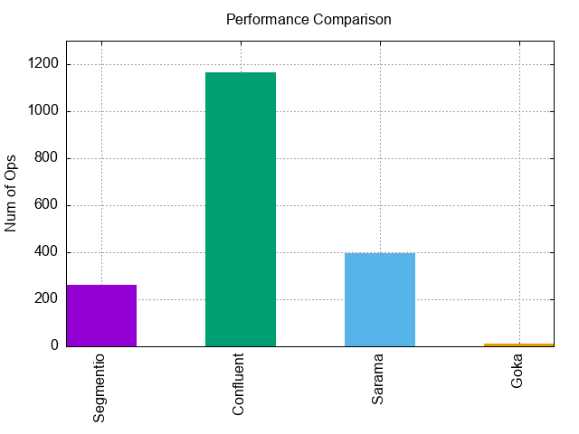
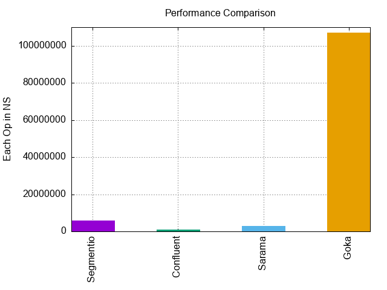

# Barmak

This is a simple project to test 4 popular [Kafka](https://kafka.apache.org/) libraries for [Go](https://go.dev/). Our libraries are :

-   [Confluent](https://github.com/confluentinc/confluent-kafka-go)
-   [Sarama](https://github.com/Shopify/sarama)
-   [Goka](https://github.com/lovoo/goka)
-   [Kafka-Go](https://github.com/segmentio/kafka-go)

## How to

We can get a simple benchmark from these libraries.

```go
func BenchmarkProduceConfluent(b *testing.B) {
    count := b.N

    messages := make([]Message, count)

    for i := 0; i < count; i++ {
        messages[i] = Message{Key: "Confluent", Value: fmt.Sprint(i)}
    }

    Confluent(messages)
}
```

## Run

There is a `Makefile` for you to run all commands.

```no-lang
Usage: make [target]

  help        Show this help message
  build       Build app's binary
  run         Run the app
  test        Run unit tests
  benchmark   Run benchmark tests
```

Change configuration in `kafka/produce.go` :

```go
var (
    host   string   = "localhost:9092"
    topic  string   = "benchmark"
)
```

Then, execute the following command to run the benchmark:

```bash
$ make benchmark

goos: darwin
goarch: arm64
pkg: arash-hatami.ir/Barmak/kafka
BenchmarkProduceSegmentio-8          367           3235080 ns/op
BenchmarkProduceConfluent-8         1137           1006395 ns/op
BenchmarkProduceSarama-8             496           2136077 ns/op
BenchmarkProduceGoka-8                10         104631917 ns/op
PASS
ok      arash-hatami.ir/Barmak/kafka    6.299s
'graphic/operations.png' and 'graphic/time_operations.png' graphics were generated.
```

And you can see the results in `graphic` directory.

Total number of operations :



Operation in nanoseconds :



Default process will be handled by the Go [testing](https://pkg.go.dev/testing#hdr-Benchmarks) package. We can also use `-benchtime=100x` argument to set the minimum amount of time that the benchmark function will run.

> **Note**: You can change the range for values in y axis. Set `y_range_max` in `Makefile` as needed.

---

## Support 💛

[](https://en.cryptobadges.io/donate/bc1qmmh6vt366yzjt3grjxjjqynrrxs3frun8gnxrz) [](https://en.cryptobadges.io/donate/0x0831bD72Ea8904B38Be9D6185Da2f930d6078094)

[](https://ko-fi.com/D1D1WGU9)

[](https://payping.ir/@hatamiarash7)

## Contributing 🤝

Don't be shy and reach out to us if you want to contribute 😉

1.  Fork it !
2.  Create your feature branch : `git checkout -b my-new-feature`
3.  Commit your changes : `git commit -am 'Add some feature'`
4.  Push to the branch : `git push origin my-new-feature`
5.  Submit a pull request

## Issues

Each project may have many problems. Contributing to the better development of this project by reporting them. 👍
